**Computer science student focused on full-stack engineering and applied AI.**
Ten original projects live on this profile — real-time systems, REST APIs, and LLM-integrated applications — each shipped with automated tests and full documentation.

### Technologies

    

     

    

### Certifications

 

Rice Center for Engineering Leadership · RCEL003 & RCEL008 · July 2026

### Featured Projects

<table align="center">
  <tr>
    <td width="50%" valign="top">
      <h4><a href="https://github.com/omxrcode/team-chat">team-chat</a></h4>
      Real-time team messaging platform with authenticated accounts, channels, presence, typing indicators, and full-text search.  React · Node.js · WebSockets · SQLite — 60 tests, including a live two-client protocol test
    </td>
    <td width="50%" valign="top">
      <h4><a href="https://github.com/omxrcode/music-streaming-api">music-streaming-api</a></h4>
      RESTful music-catalog service with a playlist-ordering engine and OpenAPI documentation.  Java 21 · Spring Boot · JPA · H2 — 30 JUnit tests
    </td>
  </tr>
  <tr>
    <td width="50%" valign="top">
      <h4><a href="https://github.com/omxrcode/algorithm-visualizer">algorithm-visualizer</a></h4>
      Interactive visualization suite for sorting, search, and pathfinding algorithms with step-through playback and complexity analysis.  React · TypeScript — 75 tests over pure step-generator implementations
    </td>
    <td width="50%" valign="top">
      <h4><a href="https://github.com/omxrcode/ai-study-assistant">ai-study-assistant</a></h4>
      Study companion that generates summaries, flashcards, quizzes, and study plans from raw notes; offline-first with a provider-agnostic LLM integration layer.  Next.js · TypeScript · SQLite — 75 tests
    </td>
  </tr>
  <tr>
    <td width="50%" valign="top">
      <h4><a href="https://github.com/omxrcode/inventory-system">inventory-system</a></h4>
      Inventory management platform with purchase orders, moving-average costing, and an append-only audit ledger.  FastAPI · SQLAlchemy · React — 92 tests
    </td>
    <td width="50%" valign="top">
      <h4><a href="https://github.com/omxrcode/multiplayer-quiz">multiplayer-quiz</a></h4>
      Real-time multiplayer trivia built on an authoritative WebSocket game server with server-side scoring and reconnect support.  Node.js · ws · React — 54 tests plus a scripted three-player end-to-end game
    </td>
  </tr>
</table>

  Four additional projects — an expense analytics dashboard, an AI command simulator, a developer analytics dashboard, and an internship tracker — are on my <a href="https://github.com/omxrcode?tab=repositories">repositories tab</a>.

### GitHub Activity

